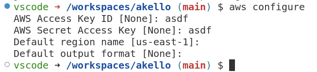
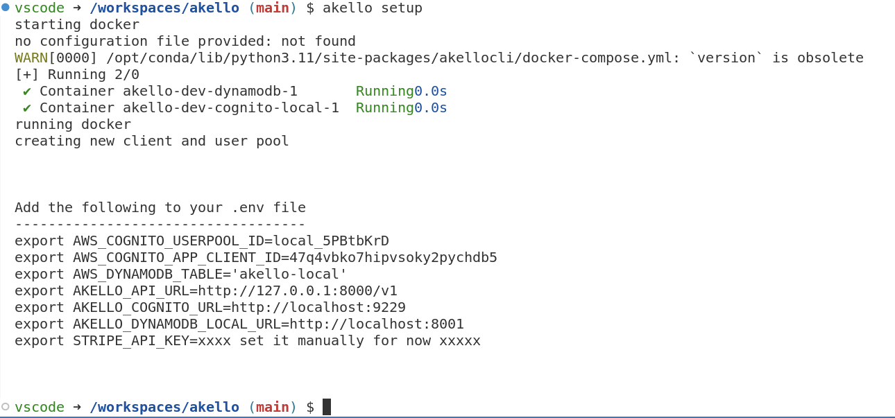

## Development Environment Setup

> This guide has been tested with Python v3.12.2 and Python v3.11.7

You will need to install the AWS CLI prior to executing these steps.



From the project root install python deps:

```sh
pip install packages/cli/
```

Perform initial setup to obtain environment variables

```sh
akello setup
```




```sh
cd packages/server/
python3 -m venv .venv
source .venv/bin/activate
pip install -r requirements.txt
uvicorn akello.main:app --reload --proxy-headers
```

At this point you have a running Akello API server.

From the root folder, run the `dev-build-single.sh`

```sh
./packages/cli/akellocli/dev-build-single.sh
```

At this point create another shell and make sure to set the environment variables
up as shown in the earlier step.

